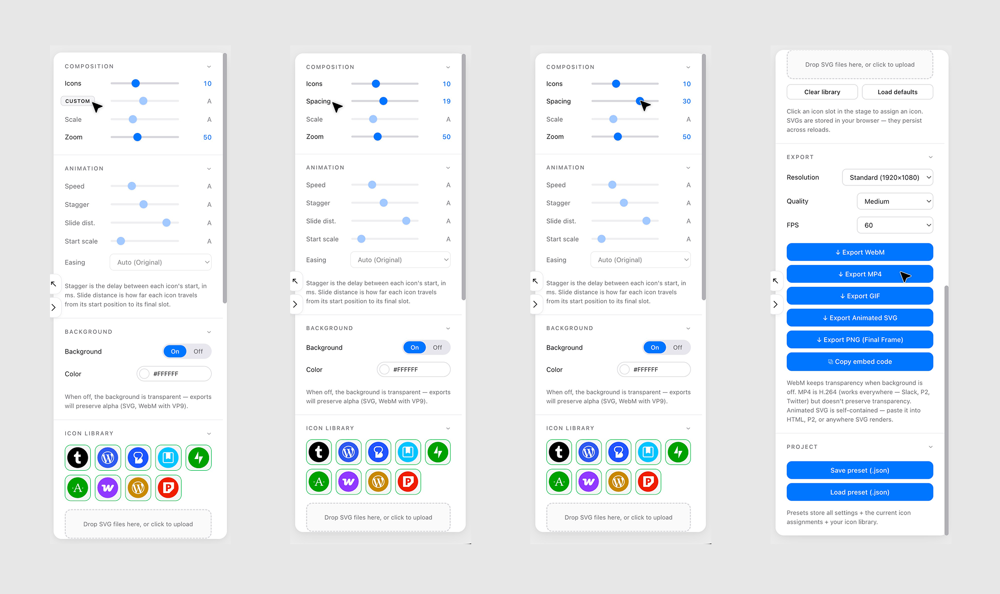
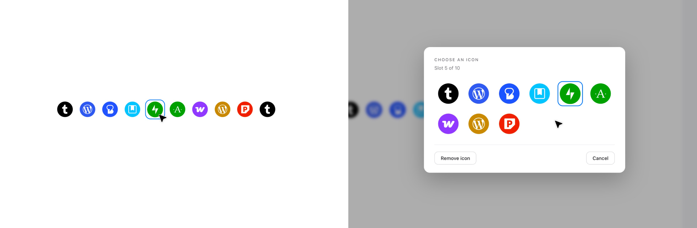
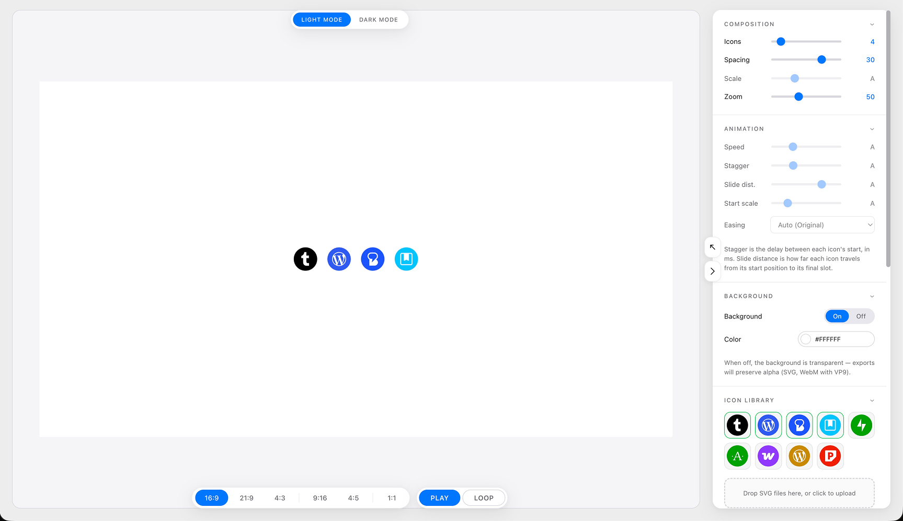
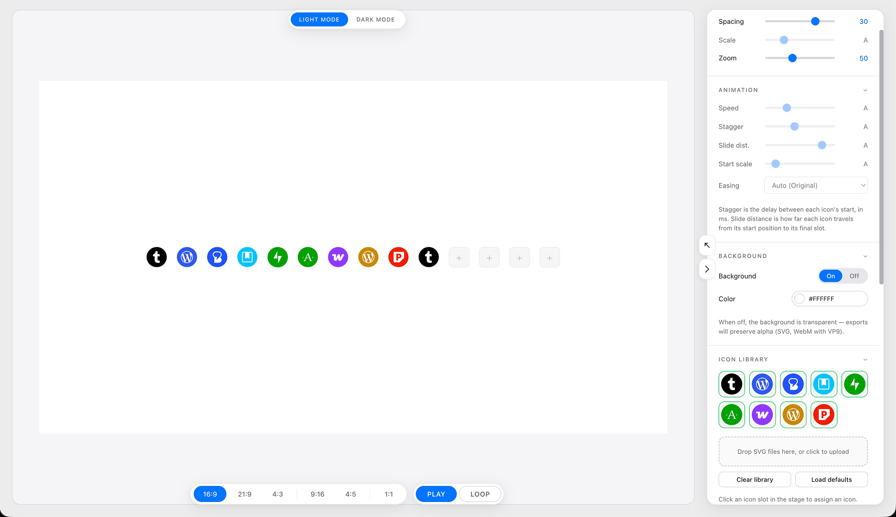
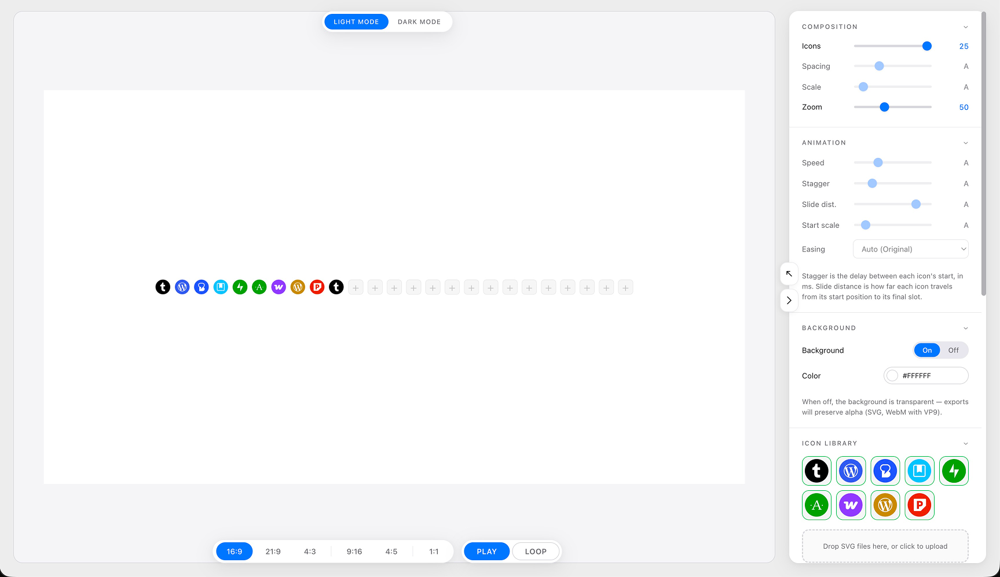

# A8c Product logos animation slide tool

A single-file browser tool for animating brand icon rows and exporting them as **MP4, WebM, GIF, animated SVG, or PNG**. No install, no build step, no server — it's one HTML file.

[**▶ Try it live**](https://nick-a8c.github.io/product-logos-slide-tool/) · [Download](product-logos-slide-tool.html)

——
——






## What it does

Drop in a set of SVG icons. Configure the row — count, spacing, scale, animation timing, easing. Hit play to preview. Export to whatever format your destination needs.

- **6 aspect ratios** — 16:9, 21:9, 4:3, 9:16, 4:5, 1:1
- **Auto mode** — every animation parameter has a smart default that scales with icon count. Override per-control as needed.
- **Three quality presets** — Low / Medium / High. High is visually lossless (every-frame keyframes for MP4).
- **Five export formats** — MP4 (H.264), WebM (VP9 with alpha), GIF, animated SVG (SMIL), PNG
- **Light & dark themes**
- **Fully offline** — every dependency is inlined. Works without network access.

## How to use

### Option 1: Open the live version

Visit [nick-a8c.github.io/product-logos-slide-tool](https://nick-a8c.github.io/product-logos-slide-tool/) in Chrome, Edge, or Safari 16.4+.

### Option 2: Run locally

Download `product-logos-slide-tool.html`, double-click to open in your browser. That's it.

### Option 3: Embed in a static site

Drop `product-logos-slide-tool.html` anywhere a static file can be served. No build, no bundler, no dependencies to install.

## Browser support

| Format | Chrome / Edge | Safari 16.4+ | Firefox |
|---|---|---|---|
| MP4 | ✓ | ✓ | ✗ |
| WebM | ✓ | ✓ | ✓ |
| GIF | ✓ | ✓ | ✓ |
| Animated SVG | ✓ | ✓ | ✓ |
| PNG | ✓ | ✓ | ✓ |

MP4 export uses the browser-native [WebCodecs](https://developer.mozilla.org/en-US/docs/Web/API/WebCodecs_API) `VideoEncoder`, which Firefox doesn't yet support. Use WebM there.

## Animation model

Icons appear **center-outward** with mirrored stagger — pairs equidistant from the center fire simultaneously, fanning out toward the ends. Slide distance is signed: negative compresses inward then flares out, positive starts spread then contracts inward. The middle icon (in odd counts) doesn't move horizontally.

## Controls

| Control | Range | What it does |
|---|---|---|
| Icons | 2 – 25 | How many slots in the row |
| Spacing | 0 – 40 | Pixel gap between icons (at canvas scale) |
| Scale | 40 – 200 | Size multiplier for each icon slot |
| Zoom | 20 – 100 | Viewport zoom (preview only, not exported) |
| Speed | 0.2s – 3.0s | Per-icon animation duration |
| Stagger | 0 – 100ms | Delay between icon pairs |
| Slide dist. | -50 – +50 | Travel distance, signed (see above) |
| Start scale | 0 – 100 | Starting size as % of final |
| Easing | dropdown | Cubic-bezier curve for each icon |

Hover any control's label to reveal an **AUTO / CUSTOM** toggle.

## Quality presets

| Preset | Use for | Approx file size (1080p, 60fps, 3s) |
|---|---|---|
| **Low** | Web-friendly, fast share | ~2 MB |
| **Medium** | Default. Crisp, reasonable size | ~6 MB |
| **High** | Visually lossless, archive | ~16 MB (~60 MB at 4K) |

## Filename format

Exports are named descriptively so you can find them later:

```
product-logos-slide-tool_1920x1080_high-q_v1.mp4
product-logos-slide-tool_1080x1920_medium-q_v1.gif
product-logos-slide-tool_preset_1920x1080_medium-q_v1.json
```

Format: `product-logos-slide-tool_<resolution>_<quality>-q_<app-version>.<ext>`

## Architecture

Single HTML file (~190 KB), three inlined script blocks:
1. `gifenc` (~9 KB) — GIF encoder
2. `mp4-muxer` (~73 KB) — MP4 container muxer
3. App code (~110 KB) — UI, animation, export pipeline

State persists in `localStorage`. No server, no analytics, no telemetry.

See `HANDOFF.md` for full architecture notes.

## Development

```bash
git clone https://github.com/nick-a8c/product-logos-slide-tool.git
cd product-logos-slide-tool
# Open index.html in a browser. That's it. No build step.
```

For a tighter dev loop, serve with any static server:
```bash
npx serve .
# or
python3 -m http.server 8000
```

## Contributing

PRs welcome. Keep it single-file. If you need a build step, propose it in an issue first.

## License

[MIT](LICENSE) — use it however you like.

## Credits

- [`gifenc`](https://github.com/mattdesl/gifenc) by Matt DesLauriers
- [`mp4-muxer`](https://github.com/Vanilagy/mp4-muxer) by Vanilagy
- Built collaboratively with Claude (Anthropic) for [Automattic's](https://automattic.com/) Radical Speed Month, 2026.
