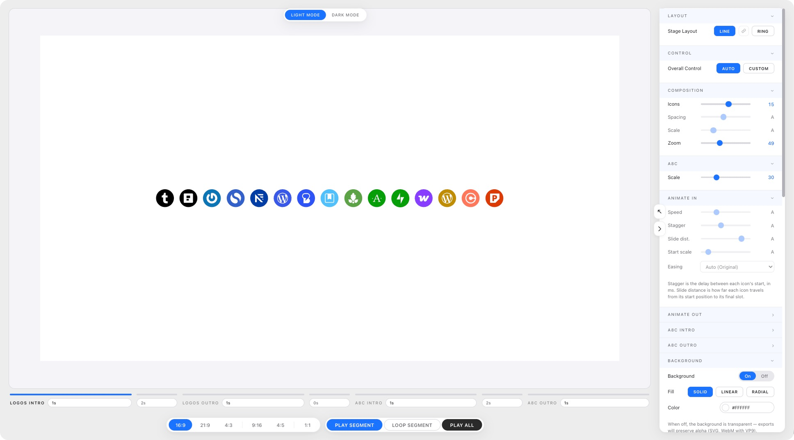
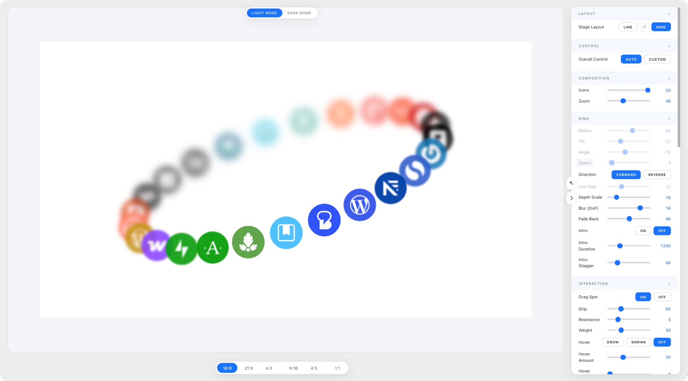

# A8c Product Logos Slide Tool

A single-file browser tool for building brand animations from a row of product icons and the **AUTOMATTIC** wordmark, then exporting them as **MP4, WebM, PNG, SVG, or a self-contained interactive HTML page**. No install, no build step, no server. One HTML file.

It ships with **two layout modes**:

- **Line** — a four-segment timeline: *logos in → logos out → AUTOMATTIC in → AUTOMATTIC out*, each segment with its own timing and easing.
- **Ring** — a continuous 3D orbit of icons with depth-of-field, optional intro, and live interactions (hover, ripple, drag-to-spin).

[**▶ Try it live**](https://nick-a8c.github.io/product-logos-slide-tool/) · [Download](product-logos-slide-tool.html)

——

<!-- Hero: drop a Ring-layout screenshot at examples/00-cover-ring.png and add it above this line for a Ring hero. -->



## What it does

Drop in a row of brand icons and configure them — count, scale, animation, background. Pick a layout, preview it, and export whatever your destination needs. Don't know where to start? The **Setup Assistant** will configure the whole thing for you from a single question.

- **Setup Assistant** — tell it *what you're making* and it sets layout, aspect, size, motion and brands for you. Everything stays editable.
- **Templates** — save a setup you like and reuse it later
- **Two layouts** — a four-segment **Line** timeline and a continuous 3D **Ring** orbit, switchable any time
- **AUTOMATTIC wordmark** — split into 10 letters that animate like the icons, using the wordmark's natural spacing
- **6 aspect ratios** — 16:9, 21:9, 4:3, 9:16, 4:5, 1:1
- **Gradient backgrounds** — solid, linear, or radial, applied in both layouts and every export
- **Auto modes** — every AUTO control scales itself to your icon count, in both Line and Ring
- **Undo / Redo** — `Ctrl/Cmd+Z` and `Ctrl/Cmd+Shift+Z`, or the two buttons in the bottom bar
- **Export formats** — MP4 (H.264), WebM (VP9 with alpha), PNG, still SVG, and an interactive self-contained HTML page (Ring)
- **Video quality presets** — Web (small) / High / Max (lossless), so shared files stay small
- **Frame-accurate stills** — pause the animation and scrub (mouse wheel or click-drag) to capture any exact frame as PNG or SVG
- **Fully offline** — every dependency is inlined. Works without network access.

## Setup Assistant

New visitors get a short **Welcome** with three doors: run the **Setup Assistant**, take the **tutorial**, or just dive in. You can reopen the assistant any time from the button at the top of the panel.

It asks a few quick things and configures the tool for you:

1. **What you're making** — Social Reel, Social post, Slide, Website hero, Logo loop, Email banner, Wallpaper. This is what drives the settings.
2. **Line or Ring** — pre-selected for you, with animated previews of each. Override it if you like.
3. **Your brands** — pick the logos, and watch a live preview of the actual layout update as you go.
4. **Review** — see exactly what will be set, then open it in the tool (and optionally save it as a template).

Guided setups always start on a clean white background. Nothing is locked in — every setting is still yours to tweak afterwards.

### Templates

Save any setup as a named template and it'll be waiting at the top of the assistant next time. Templates capture the design (layout, brands, motion, aspect, background) — not your theme or panel position. They're stored in your browser; the existing JSON preset export still works for sharing across machines.

## Undo / Redo

Every change is undoable — sliders, layout switches, icon swaps, background, the assistant, template loads.

- **`Ctrl/Cmd+Z`** to undo, **`Ctrl/Cmd+Shift+Z`** (or `Ctrl+Y`) to redo, or use the two circular buttons in the bottom bar.
- Dragging a slider counts as **one** undo step, not one per pixel.
- History is per-session (50 steps) and resets when you reload. It never touches your theme or panel position.

## How to use

### Option 1: Open the live version

Visit [nick-a8c.github.io/product-logos-slide-tool](https://nick-a8c.github.io/product-logos-slide-tool/) in Chrome, Edge, or Safari 16.4+.

### Option 2: Run locally

Download `product-logos-slide-tool.html`, double-click to open in your browser.

### Option 3: Embed in a static site

Drop `product-logos-slide-tool.html` anywhere a static file can be served. No build, no bundler.

## Line layout — the four-segment timeline

**Row or Column.** Under Stage Layout, an *Arrangement* toggle stacks the icons horizontally (Row) or vertically (Column). Column slides the icons in on the vertical axis — best for portrait aspects (9:16, 4:5) — and sizes them to fill the stage height automatically. The AUTOMATTIC wordmark always animates horizontally, unchanged, in either arrangement.

The four segments live on a horizontal timeline under the stage. Click any segment pill to focus and replay it. Each segment has:

- A **duration dropdown** (0–10s) on the right
- An **animation panel** (Animate IN / Animate OUT / A8C Intro / A8C Outro) with Speed, Stagger, Slide distance, Start scale, and Easing
- A short **inter-segment pause** dropdown sitting between it and the next segment

Three play buttons live in the bottom bar:

- **PLAY SEGMENT** — plays the currently focused segment
- **LOOP SEGMENT** — loops the currently focused segment
- **PLAY ALL** — walks all four segments back-to-back, honoring the pause dropdowns

### Animation model

- **Intros** play *inner first → outer last*: middle icons land first, outer icons fan out with stagger.
- **Outros** by default mirror the intros (inner first → outer last); each outro panel has an **Order of movement** toggle that flips this to *outer first → inner last*.
- Slide distance is signed: negative compresses inward then flares out, positive starts spread then contracts in. Outermost icons travel ±100px max. Middle icon stays put.

## Ring layout — the 3D orbit

Switch **Stage Layout** to **RING** for a continuous orbit instead of a timeline. Icons travel a tilted ellipse with depth-of-field: icons toward the back scale down, blur, and fade; icons in front are sharp and full-size.

**Ring controls** — Radius, Tilt, Angle, Speed, Direction (forward/reverse), Icon Size, Depth Scale, Blur (DoF), and Fade Back, plus an optional staggered **Intro**.

### Ring AUTO / CUSTOM

The **Overall Control** at the top works in Ring mode too:

- **AUTO** sizes the ring for you. **Tilt** and **Angle** follow the aspect ratio, while **Radius** and **Icon Size** scale with your **icon count** — the same way Line's Spacing and Scale do. Add icons and the ring grows and the logos shrink to fit; remove them and it tightens back up. Those sliders appear grayed out (still draggable — grabbing one drops you into CUSTOM).
- **CUSTOM** hands you full manual control of every Ring setting.
- AUTO is **non-destructive**: switching to AUTO stashes your CUSTOM "playground." Switch back without touching anything and it's restored exactly. The first time you change *any* Ring setting in AUTO, the stash is committed and CUSTOM keeps the new values.

Radius / Icon Size are tuned per aspect, interpolated between these anchor points:

| Aspect | 3 icons | 7 icons | 10 icons | 16 icons | 25 icons |
|---|---|---|---|---|---|
| 16:9 & 21:9 | 20 / 18 | 25 / 16 | 29 / 15 | 40 / 14 | 48 / 12 |
| 4:3 | — | 29 / 14 | — | — | 57 / 9 |
| 9:16 | — | 60 / 11 | — | — | 87 / 7 |
| 4:5 | — | 47 / 14 | — | — | 81 / 10 |
| 1:1 | — | 61 / 17 | — | — | 75 / 10 |

*(All six ratios go to 26 icons — the full library — in Ring. In Line, 9:16 / 4:5 / 1:1 cap at 18 — a horizontal row can't fit more across a 1080px-wide frame without clipping.)*

### Ring interactions

These run in the live preview and in the exported interactive HTML (never in video exports):

- **Hover** — grow or shrink the icon under the cursor, with an adjustable **spread** that eases the effect into neighboring icons
- **Ripple** — **Shift-click** the ring to send a wave travelling both ways around the orbit
- **Drag-to-spin** — grab the ring and fling it; **Grip / Resistance / Weight** shape how it grabs, decays, and settles back into auto-rotation

A plain click on any ring icon opens the picker to swap it — same as Line. (That's why ripple is Shift-click here.)

### Layout link

The chain button between **LINE** and **RING** mirrors the settings the two layouts share (icon count, zoom, background). It's **off by default** for new visitors — each layout keeps its own copy of those settings, so switching layouts doesn't disturb the other. Turn it on to keep them in sync.

## Backgrounds

A single background control feeds the live stage and every exporter. Choose **Solid**, **Linear**, or **Radial**:

- Solid uses one color.
- Linear/Radial blend between two colors, with angle (linear), center position (radial), and spread controls.

Backgrounds can also be turned off entirely — useful for WebM and SVG exports, which preserve transparency.

## The panel — Essentials and Advanced

The panel opens in **Essentials**: roughly seven controls — the decisions you actually make. **Advanced** reveals every control the tool has. Nothing is removed in Essentials and nothing is renamed in Advanced; it's the same panel, filtered.

- **Motion → Feel** — *Calm / Balanced / Snappy* sets the pace across all four Line segments in one click. Tune any individual timing and it switches to *Custom*, so the label never claims a preset you've since edited.
- **Motion is contextual** — under Advanced, one Motion section with an *In / Out / A8C in / A8C out* toggle, instead of four near-identical panels. *Order of movement* appears only for the outros, where it applies.
- **While AUTO is on**, Essentials says so in one line — *"Spacing & scale sized automatically"* — with a **Customise** button, rather than showing you six greyed-out sliders.

Your tier is remembered between visits.

## Controls

Everything below is in **Advanced**; the Essentials view shows the subset you need to get a good result.

| Control | Range | Scope | What it does |
|---|---|---|---|
| Icons | 2 – 26 (Line caps at 18 on 9:16 / 4:5 / 1:1) | Composition | How many icons in the row / ring |
| Spacing | 0 – 40 | Composition (Line) | Pixel gap between icons (doesn't affect the wordmark) |
| Scale | 40 – 200 | Composition (Line) | Size multiplier for each icon |
| Zoom | 20 – 100 | Composition (preview only) | Viewport zoom (not exported) |
| A8C scale | 10 – 80 | A8C section (Line) | Wordmark height — separate from icon scale |
| Speed | 0.2s – 3.0s | Per-segment (Line) | Per-item animation duration |
| Stagger | 0 – 100ms | Per-segment (Line) | Delay between paired items |
| Slide dist. | -50 – +50 | Per-segment (Line) | Travel distance, signed |
| Start scale | 0 – 100 | Per-segment (Line) | Starting size as % of final |
| Easing | dropdown | Per-segment (Line) | Cubic-bezier curve |
| Order of movement | toggle | Outros only (Line) | Inner-first (default) vs outer-first stagger |
| Radius / Tilt / Angle | sliders | Ring | Orbit geometry |
| Speed / Direction | slider + toggle | Ring | Rotation rate and direction |
| Icon Size | slider | Ring | Icon size on the orbit |
| Depth Scale / Blur (DoF) / Fade Back | sliders | Ring | Depth-of-field falloff toward the back |
| Intro | toggle + sliders | Ring | Optional staggered fade-in |
| Hover / Ripple / Drag-spin | toggles + sliders | Ring | Live interactions |

In Line mode, hover any control's label to reveal its **AUTO / CUSTOM** toggle. In Ring mode, the **Overall Control** at the top drives AUTO / CUSTOM for the whole shape.

## Exports

The export panel splits into **Motion** (WebM, MP4, Interactive HTML / embed) and **Stills** (PNG, SVG). Every export uses **4× full-frame supersampling** (downsampled via a halving pyramid) and a **6× SVG bitmap raster** with a 6% transparent margin, so edges stay clean at output resolution.

### Video quality

A **Quality** dropdown controls MP4/WebM file size by trading off bitrate and inter-frame compression:

| Preset | Use it for |
|---|---|
| **Web (small)** | Sharing — Slack, P2, social. Smallest files. |
| **High** *(default)* | Great quality, roughly 20× smaller than lossless. |
| **Max (lossless)** | Archival — every frame a keyframe, very large files. |

### Motion

**Line** — pick which segment(s) render via the `1 / 2 / 3 / 4 / ALL` toggle:

| Range | What you get |
|---|---|
| `1` | Just Logos Intro |
| `2` | Just Logos Outro |
| `3` | Just A8C Intro |
| `4` | Just A8C Outro |
| `ALL` | All four segments back-to-back with your configured pauses between them |

**Ring** — video covers exactly one revolution, so it loops seamlessly (plus the intro if enabled). **Export Interactive HTML** produces a self-contained page with the orbit and all interactions baked in — host it anywhere, no dependencies. (Video locks out at the highest spin speeds, where a single revolution is too short for smooth playback; stills stay available.)

### Stills (PNG + SVG)

PNG and SVG capture a single frame. To pick the exact one, hit **Pause Animation**, then **scroll the mouse wheel or click-drag across the stage** to scrub (Ring → orbit angle, Line → segment time), and export.

- **PNG** — rasterized current frame.
- **SVG** — vector current frame. In Ring, the depth-of-field blur is baked in as native SVG filters, so the still matches the on-screen look while staying scalable.

## Browser support

| Format | Chrome / Edge | Safari 16.4+ | Firefox |
|---|---|---|---|
| MP4 | ✓ | ✓ | ✗ |
| WebM | ✓ | ✓ | ✓ |
| PNG | ✓ | ✓ | ✓ |
| SVG | ✓ | ✓ | ✓ |
| Interactive HTML | ✓ | ✓ | ✓ |

MP4 export uses the browser-native [WebCodecs](https://developer.mozilla.org/en-US/docs/Web/API/WebCodecs_API) `VideoEncoder`, which Firefox doesn't yet support. Use WebM there. MP4 (H.264) does not preserve transparency — use WebM or SVG if you need an alpha channel.

## Filename format

```
product-logos-slide-tool_1920x1080_v2.2.mp4
product-logos-slide-tool_1080x1920_v2.2.png
product-logos-slide-tool_preset_1920x1080_v2.2.json
```

Format: `product-logos-slide-tool_<resolution>_<app-version>.<ext>`

## Architecture

Single HTML file (~444 KB), three inlined script blocks:
1. `gifenc` (~9 KB) — GIF encoder, retained from earlier versions (GIF export has since been removed)
2. `mp4-muxer` (~73 KB) — MP4 container muxer
3. App code — UI, animation, both layout engines, sequencer, export pipeline

State persists in `localStorage`. No server, no analytics, no telemetry.

See `HANDOFF.md` for full architecture notes.

## Development

```bash
git clone https://github.com/nick-a8c/product-logos-slide-tool.git
cd product-logos-slide-tool
# Open index.html in a browser. That's it. No build step.
```

For a tighter dev loop, serve with any static server:

```bash
npx serve .
# or
python3 -m http.server 8000
```

`index.html` and `product-logos-slide-tool.html` are kept identical — edit one, copy to the other.

## Contributing

PRs welcome. Keep it single-file. If you need a build step, propose it in an issue first.

## License

[MIT](LICENSE) — use it however you like.

## Credits

- [`gifenc`](https://github.com/mattdesl/gifenc) by Matt DesLauriers
- [`mp4-muxer`](https://github.com/Vanilagy/mp4-muxer) by Vanilagy
- Built collaboratively with Claude (Anthropic) for [Automattic's](https://automattic.com/) Radical Speed Month, 2026.
