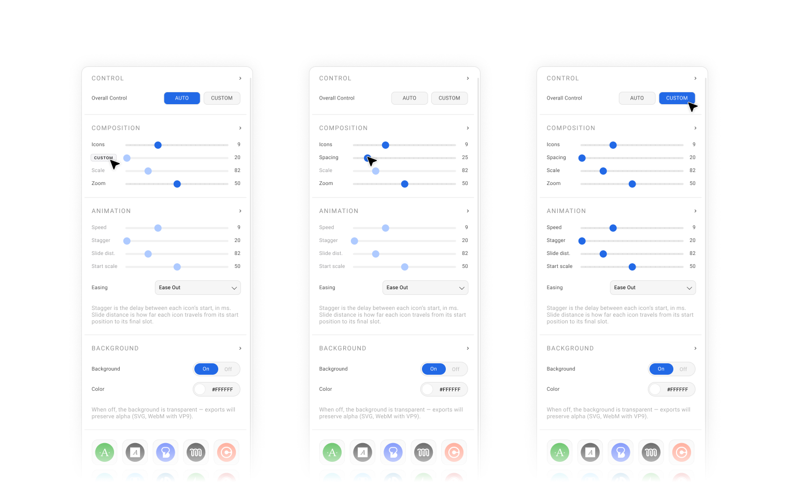

# A8c Product Logos Slide Tool

A single-file browser tool for composing a four-segment brand animation — **logos in → logos out → AUTOMATTIC wordmark in → AUTOMATTIC wordmark out** — and exporting any segment or the full sequence as **MP4, WebM, GIF, animated SVG, or PNG**. No install, no build step, no server. One HTML file.

[**▶ Try it live**](https://nick-a8c.github.io/product-logos-slide-tool/) · [Download](product-logos-slide-tool.html)

——



## What it does

Drop in a row of brand icons. Configure them — count, spacing, scale, animation timing, easing. Add the AUTOMATTIC wordmark as an intro + outro. Hit play on a specific segment to preview, or PLAY ALL to walk the whole sequence. Export whatever segment(s) your destination needs.

- **Four-segment timeline** — Logos Intro, Logos Outro, A8C Intro, A8C Outro. Each segment has its own animation params and a duration dropdown. Between segments are configurable pauses (0–10s).
- **AUTOMATTIC wordmark** — built in as a new asset type. The logo is split into 10 letters that animate just like the icons, using the wordmark's natural source spacing.
- **6 aspect ratios** — 16:9, 21:9, 4:3, 9:16, 4:5, 1:1
- **Auto mode** per animation control, plus global AUTO / CUSTOM shortcuts
- **Order of movement** toggle on the two outro segments (inner first vs outer first)
- **Five export formats** — MP4 (H.264), WebM (VP9 with alpha), GIF, animated SVG (SMIL), PNG
- **Export range selector** — `1 / 2 / 3 / 4 / ALL`. Pick which segments the exporter renders
- **Fully offline** — every dependency is inlined. Works without network access.

## How to use

### Option 1: Open the live version

Visit [nick-a8c.github.io/product-logos-slide-tool](https://nick-a8c.github.io/product-logos-slide-tool/) in Chrome, Edge, or Safari 16.4+.

### Option 2: Run locally

Download `product-logos-slide-tool.html`, double-click to open in your browser.

### Option 3: Embed in a static site

Drop `product-logos-slide-tool.html` anywhere a static file can be served. No build, no bundler.

## Browser support

| Format | Chrome / Edge | Safari 16.4+ | Firefox |
|---|---|---|---|
| MP4 | ✓ | ✓ | ✗ |
| WebM | ✓ | ✓ | ✓ |
| GIF | ✓ | ✓ | ✓ |
| Animated SVG | ✓ | ✓ | ✓ |
| PNG | ✓ | ✓ | ✓ |

MP4 export uses the browser-native [WebCodecs](https://developer.mozilla.org/en-US/docs/Web/API/WebCodecs_API) `VideoEncoder`, which Firefox doesn't yet support. Use WebM there.

## The timeline

The four segments live on a horizontal timeline under the stage. Click any segment pill to focus and replay it. Each segment has:

- A **duration dropdown** (0–10s) on the right
- An **animation panel** in the side panel (Animate IN / Animate OUT / A8C Intro / A8C Outro) with Speed, Stagger, Slide distance, Start scale, and Easing
- A short **inter-segment pause** dropdown sitting between it and the next segment

Three play buttons live in the bottom bar:

- **PLAY SEGMENT** — plays the currently focused segment
- **LOOP SEGMENT** — loops the currently focused segment
- **PLAY ALL** — walks all four segments back-to-back, honoring the pause dropdowns

## Animation model

- **Intros** play *inner first → outer last*: middle icons land first, outer icons fan out with stagger.
- **Outros** by default mirror the intros (inner first → outer last); each outro panel has an **Order of movement** toggle that flips this to *outer first → inner last*.
- Slide distance is signed: negative compresses inward then flares out, positive starts spread then contracts in. Outermost icons travel ±100px max. Middle icon stays put.

## Controls

| Control | Range | Scope | What it does |
|---|---|---|---|
| Icons | 2 – 25 (or 18 for 9:16 / 4:5 / 1:1) | Composition | How many slots in the row |
| Spacing | 0 – 40 | Composition | Pixel gap between icons (doesn't affect A8C — wordmark spacing is built in) |
| Scale | 40 – 200 | Composition | Size multiplier for each icon slot |
| Zoom | 20 – 100 | Composition (preview only) | Viewport zoom (not exported) |
| A8C scale | 10 – 80 | A8C section | Wordmark height — separate from icon scale |
| Speed | 0.2s – 3.0s | Per-segment | Per-item animation duration |
| Stagger | 0 – 100ms | Per-segment | Delay between paired items |
| Slide dist. | -50 – +50 | Per-segment | Travel distance, signed |
| Start scale | 0 – 100 | Per-segment | Starting size as % of final |
| Easing | dropdown | Per-segment | Cubic-bezier curve |
| Order of movement | toggle | Outros only | Inner-first (default) vs outer-first stagger |

Hover any control's label to reveal an **AUTO / CUSTOM** toggle.

## Exports

Export quality is fixed at the maximum tier (no quality dropdown — quality always > size). Every export uses:

- **4× full-frame supersampling** rendered into an offscreen buffer, then downsampled via a halving pyramid for clean anti-aliased edges at output resolution
- **6× SVG bitmap raster** (with a 512 px floor and 6% transparent margin per icon) so circular edges survive downsampling
- **Every-frame keyframes** in MP4 and 1.0 bpp video bitrate — visually lossless
- **Full-resolution GIF** (up to canvas width) with 256-color rgb565 palette

Pick which segment(s) get rendered via the `1 / 2 / 3 / 4 / ALL` toggle:

| Range | What you get |
|---|---|
| `1` | Just Logos Intro |
| `2` | Just Logos Outro |
| `3` | Just A8C Intro |
| `4` | Just A8C Outro |
| `ALL` | All four segments back-to-back with your configured pauses between them |

PNG = the final frame of the last selected segment.

## Filename format

```
product-logos-slide-tool_1920x1080_v2.mp4
product-logos-slide-tool_1080x1920_v2.gif
product-logos-slide-tool_preset_1920x1080_v2.json
```

Format: `product-logos-slide-tool_<resolution>_<app-version>.<ext>`

## Architecture

Single HTML file (~300 KB), three inlined script blocks:
1. `gifenc` (~9 KB) — GIF encoder
2. `mp4-muxer` (~73 KB) — MP4 container muxer
3. App code (~220 KB) — UI, animation, sequencer, export pipeline

State persists in `localStorage`. No server, no analytics, no telemetry.

See `HANDOFF.md` for full architecture notes.

## Development

```bash
git clone https://github.com/nick-a8c/product-logos-slide-tool.git
cd product-logos-slide-tool
# Open index.html in a browser. That's it. No build step.
```

For a tighter dev loop, serve with any static server:

```bash
npx serve .
# or
python3 -m http.server 8000
```

## Contributing

PRs welcome. Keep it single-file. If you need a build step, propose it in an issue first.

## License

[MIT](LICENSE) — use it however you like.

## Credits

- [`gifenc`](https://github.com/mattdesl/gifenc) by Matt DesLauriers
- [`mp4-muxer`](https://github.com/Vanilagy/mp4-muxer) by Vanilagy
- Built collaboratively with Claude (Anthropic) for [Automattic's](https://automattic.com/) Radical Speed Month, 2026.
